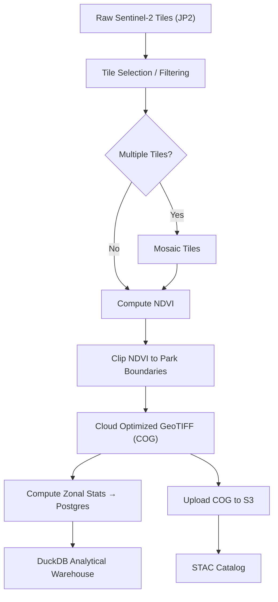

# satellite-ndvi-pipeline

## 🌿 [Live Dashboard](https://satellite-ndvi-pipeline.streamlit.app/)

---

## Overview

An end-to-end geospatial data pipeline for processing satellite-derived NDVI (Normalized Difference Vegetation Index) data across US National Parks. The pipeline ingests Sentinel-2 imagery, produces Cloud Optimized GeoTIFFs (COGs), computes zonal statistics, and models the results in a DuckDB analytical warehouse.

Processed COGs and statistics are stored on AWS S3, allowing new users to explore the warehouse and dashboard without running the full pipeline. The full ingestion pipeline is included for users who want to process new parks or date ranges.

**Parks covered:** Yosemite, Zion, Acadia — chosen for ecological contrast across alpine, desert, and coastal environments.

---

## Pipeline Architecture



---

## Quick Start

Get the warehouse and dashboard running locally in minutes — no satellite data processing, no Docker, no Postgres required.

> **Just want to see the dashboard?** Visit the [live hosted version](https://satellite-ndvi-pipeline.streamlit.app/) — no setup needed.

### Prerequisites

- Python 3.10+
- No AWS credentials required

### Steps

**1. Clone the repo**
```bash
git clone https://github.com/jkf735/satellite_ndvi_pipeline.git
cd satellite-ndvi-pipeline
```

**2. Install dependencies**
```bash
pip install -r requirements.txt
```

**3. Run quickstart**

Downloads pre-processed statistics from S3 and builds the local DuckDB warehouse:
```bash
python3 quickstart.py
```

To re-download fresh data from S3:
```bash
python3 quickstart.py --overwrite
```

To inspect the warehouse directly:
```bash
duckdb warehouse/warehouse.db
.help
```

**4. Launch the dashboard**
```bash
streamlit run dashboard/Overview.py
```

The dashboard will open at `http://localhost:8501`.

**Note:** The NDVI Map page requires a running Titiler instance. To enable it locally run this in a second terminal:
```bash
uvicorn dashboard.titiler_app:app --host 0.0.0.0 --port 8001
```

---

## Full Pipeline

The full pipeline downloads raw Sentinel-2 tiles, processes them into COGs, computes zonal statistics, and populates the warehouse. Use this to add new parks or date ranges.

### Prerequisites

- Python 3.10+
- Docker and Docker Compose
- AWS CLI configured with S3 access
- GDAL system dependencies

### Environment Setup

**1. Clone the repo**
```bash
git clone https://github.com/jkf735/satellite_ndvi_pipeline.git
cd satellite-ndvi-pipeline
```

**2. Install dependencies**
```bash
pip install -r requirements-full.txt
```

**3. Configure paths**

Update `LOCAL_ROOT` in `scripts/resources/config.py` to match your local environment (by default the project is setup using WSL with a `LOCAL_ROOT` being mounted to your local system).

By default the project stores raster data outside the WSL virtual disk. Ensure your `/etc/wsl.conf` contains:
```ini
[automount]
enabled = true
root = /mnt/
options = "metadata"
```
After editing, restart WSL:
```powershell
wsl --shutdown
```

**4. Configure environment**

Copy `.env.example` to `.env` and update with your credentials (they can also be safely left as default):
```bash
cp .env.example .env
```

**5. Start Postgres**
```bash
make up
```
This spins up a Postgres container and Adminer (available at `http://localhost:8080`). If using your own Postgres instance, skip this step and update `.env` with your connection details.

**6. Initialize the database**
```bash
make init
```
Creates the following tables in Postgres: `park_ndvi_stats`, `parks_raw`, `parks_repaired`, `parks_validated`, `parks_qa_failures`.

### Running the Pipeline

```bash
# Run full ingestion for one or more parks and date ranges
make full PARKS="yosemite zion" YEARS="2024 2025" MONTHS="2 3 4 5 6 7" CLEANUP=True

# Build the DuckDB warehouse from Postgres
make warehouse

# Launch the dashboard locally
streamlit run dashboard/Overview.py
```

Individual pipeline steps can also be run separately:
```bash
make ingest_tiles PARK=Yosemite YEAR=2025 MONTH=11
make ndvi PARK=Yosemite YEAR=2025 MONTH=11
make clip PARK=Yosemite YEAR=2025 MONTH=11
make zonal_stats
```

### Publishing Updated Data to S3

If you want to publish to your own S3 bucket rather than cloning the project data:

1. Create an S3 bucket in your AWS account
2. Configure AWS credentials locally: `aws configure`
3. Update `S3_BUCKET_NAME` in `config.py`
4. Run the upload commands below

If you just want to add data locally without publishing to S3, you can skip these steps and just run `make warehouse` after ingestion.

```bash
# Upload new COGs
make s3_cog_upload

# Regenerate STAC catalog
make s3_stac_upload

# Export updated stats to S3
make s3_stats_export
```

---

## Project Structure

```
satellite-ndvi-pipeline/
│
├── quickstart.py               # Quick start script for new users
│
├── data/
│   ├── raw/                    # Downloaded Sentinel-2 JP2 tiles, nps_boundary.geojson, sentinel_shapefiles
│   ├── interim/                # Mosaic and NDVI outputs
│   ├── processed/              # Park-clipped COG outputs
│   └── quickstart/             # Parquet files downloaded by quickstart
│
├── docker/                     # Docker Compose for Postgres
│
├── logs/                       # Log files
│
├── scripts/
│   ├── resources/              # Config (constants), and cache
│   ├── full_ingest.py          # Orchestrates full pipeline
│   ├── tile_ingest.py          # Downloads and filters Sentinel-2 tiles
│   ├── compute_ndvi.py         # Computes NDVI from B04/B08 bands
│   ├── clip_to_park.py         # Clips NDVI to park boundary, writes COG
│   ├── compute_zonal_stats.py  # Computes stats and loads to Postgres
│   ├── build_warehouse.py      # Builds DuckDB warehouse from Postgres or parquet
│   ├── s3_stac_upload.py       # Generates and uploads STAC catalog to S3
│   ├── s3_cog_upload.py        # Uploads COGs to S3
│   ├── s3_stats_export.py      # Exports Postgres stats to S3 as parquet
│   ├── init.py                 # Initializes Postgres schema and verifies file structure
│   └── db.py                   # Postgres connection helper
│
├── sql/
│   ├── qa/                     # QA validation functions
│   └── schema/                 # Table creation SQL
│
├── warehouse/
│   ├── models/
│   │   ├── dimensions/         # dim_park, dim_date
│   │   ├── facts/              # fact_ndvi
│   │   └── marts/              # Analytical marts (see below)
│   ├── tests/                  # Warehouse data quality tests
│   └── warehouse.db            # Local DuckDB warehouse
│
├── dashboard/
│   ├── Overview.py             # Dashboard entry point
│   ├── titiler_app.py          # Local Titiler tile server
│   ├── db.py                   # DuckDB connection helper
│   ├── static/                 # Pipeline stage images
│   └── pages/                  # Dashboard pages
│
├── titiler_service/            # Hosted Titiler deployment (Render)
│
├── .env.example                # Environment variable template
├── Makefile                    # Pipeline commands
├── requirements.txt            # Quick start dependencies
├── requirements-full.txt       # Full pipeline dependencies
└── README.md
```

---

## Warehouse Architecture

The warehouse follows a layered structure inspired by dbt-style projects:

```
raw → dimensions → facts → marts
```

### Schemas

**`raw`** — staging tables loaded directly from Postgres or parquet:
- `raw.stg_parks`
- `raw.stg_ndvi`

**`analytics`** — core dimensional models:
- `analytics.dim_park`
- `analytics.dim_date`
- `analytics.fact_ndvi`

**`marts`** — analytics-ready views for specific use cases:
- `marts.mart_ndvi_monthly` — monthly NDVI aggregation per park
- `marts.mart_ndvi_trend` — rolling NDVI trends
- `marts.mart_declining_parks` — long-term NDVI slope per park
- `marts.mart_ndvi_seasonality` — seasonal NDVI averages
- `marts.mart_ndvi_anomalies` — z-score based anomaly detection per calendar month

---

## S3 Architecture

Processed COGs and catalog metadata are stored in S3 with the following structure:

```
s3://satellite-ndvi-pipeline/
├── processed/
│   └── {park_name}/
│       └── {park_name}_{year}_{month}_{day}_NDVI.tif   # COGs
├── stac/
│   ├── catalog.json
│   ├── collections/
│   │   └── ndvi_cog.json
│   └── items/
│       └── {park_name}_{year}_{month}_{day}_NDVI.json  # STAC items
├── stats/
│   ├── park_ndvi_stats.parquet
│   └── parks_validated.parquet
└── nps_boundary.geojson
```

COGs are queryable via the STAC catalog and streamed directly from S3 by the dashboard map layer using Titiler.

---

## Known Limitations

**Tile Selection** — Tile selection relies on `CLOUDY_PIXEL_PERCENTAGE` from Sentinel-2 `metadata.xml`. This metric does not capture all atmospheric interference — thin cirrus clouds and coastal haze can pass the filter while still degrading NDVI values. A weighted scoring algorithm selects the best available tile per month but cannot guarantee a clean tile exists for every month in every year.

**Processing Baseline Discontinuity** — ESA changed the Sentinel-2 L2A processing baseline from N0400 to N0500 in 2022, introducing a systematic offset in surface reflectance values. Pre and post 2022 NDVI values are not directly comparable. Therefore, pre 2022 data is currently excluded.

**Sentinel Value Filtering** — Pixels with NDVI below -0.4 are excluded from zonal statistics as they represent corrupted or invalid data rather than real surface reflectance. This threshold was determined empirically from the distribution of pixel values.

**Coastal Tile Coverage** — For coastal parks (Acadia), Sentinel-2 tile boundaries frequently include large ocean areas which inflate nodata percentages in tile metadata. Coverage scoring accounts for this through tile position weighting.

**Snow and Non-Vegetated Pixels** — Yosemite contains significant areas of exposed granite, water bodies, and seasonal snow which permanently suppress park-wide mean NDVI. Month-to-month variance is higher for Yosemite than Zion or Acadia for this reason.

**Anomaly Detection** — Z-scores are computed per park per calendar month across available years. Months with only one year of data return null z-scores and are excluded from anomaly detection.