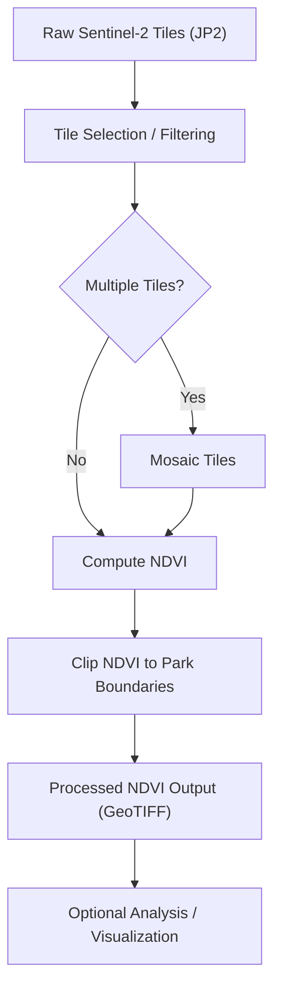

# satellite-ndvi-pipeline

A workflow to download, process, and analyze Sentinel-2 satellite imagery for parks and protected areas. The pipeline automates everything from fetching raw tiles to producing clipped NDVI rasters ready for analysis.

---

## Features

- Fetches Sentinel-2 tiles from AWS S3
- Selects low-cloud, high-coverage imagery automatically
- Mosaics multiple tiles into a seamless composite
- Computes NDVI (Normalized Difference Vegetation Index)
- Clips NDVI rasters to park or protected area boundaries
- Stores outputs in a structured directory layout
- Logs and caches tile metadata for reproducibility

---

## Pipeline Overview



---

## Project Structure

```
satellite-ndvi-pipeline/
│
├── data/
│   ├── raw/                # Downloaded Sentinel-2 JP2 tiles, shapefiles, and boundary.geojsons
│   ├── interim/            # Mosaic and NDVI outputs
│   └── processed/          # Park clipped NDVI outputs
│
├── docker/                   # Docker files
|
├── logs/                   # Log files
|
├── scripts/                # Python scripts for downloading, mosaicking, and processing
|   ├── resources/          # Config files, Cache files, and temporary/interim data
│   ├── init.py
│   ├── da.py
│   ├── tile_ingest.py
│   ├── mosaic_tiles.py
│   ├── compute_ndvi.py
│   ├── clip_to_park.py
│   └── find_tile.py
├── sql/                    # SQL functions
|   ├── qa/                 # QA functions (park_validation)
|   ├── schema/             # Functions to create tables (parks_raw, parks_ndvi_stats)
|
├── Makefile                # Commands to run pipeline steps with arguments
├── .env.example            # Used to automatically generate a .env file if one is not provided
├── requirements.txt        # Python dependencies
└── README.md
```
Project is setup by default to exist in a containerized WSL environment with data stored locally. This can be configured in config.py (see below)

---

## Getting Started

## Prerequisites

### WSL2 Configuration
This project stores raster data outside the WSL virtual disk to avoid bloating the `.vhdx` file.
Ensure your `/etc/wsl.conf` contains the following:
```ini
[automount]
enabled = true
root = /mnt/
options = "metadata"
```

After editing, restart WSL:
```powershell
wsl --shutdown
```

### Data Directory
By default the project expects data to live at `/mnt/d/Code/Projects/satellite-ndvi-pipeline/data/`.
Update `LOCAL_ROOT` in `satellite_ndvi_pipeline/config.py` to match your local path before running.
If you are not using WSL you can replace all instances of LOCAL_ROOT with PROJECT_ROOT.

### Standard Setup
Update LOCAL_ROOT and PROJECT_ROOT to necessary paths depending on what type of environment you use (fully local, wsl, docker container, etc.)

All Python dependencies are listed in `requirements.txt`. Install them with:

```bash
pip install -r requirements.txt
```

Initialize the environment:

```bash
make up
make init
```
If you prefer not to use Docker, you can skip 'make up'.

---

## Usage

Run the pipeline steps in order using the provided Makefile targets:

```bash
TBD
```

Additional scripts can be invoked directly from the `scripts/` directory or via custom Makefile targets for more granular control over individual pipeline steps.

---

## Configuration

Pipeline paths, database connection strings, and constants are managed in `satellite_ndvi_pipeline/scripts/config.py`. This file can be updated to match your local environment or AWS configuration.